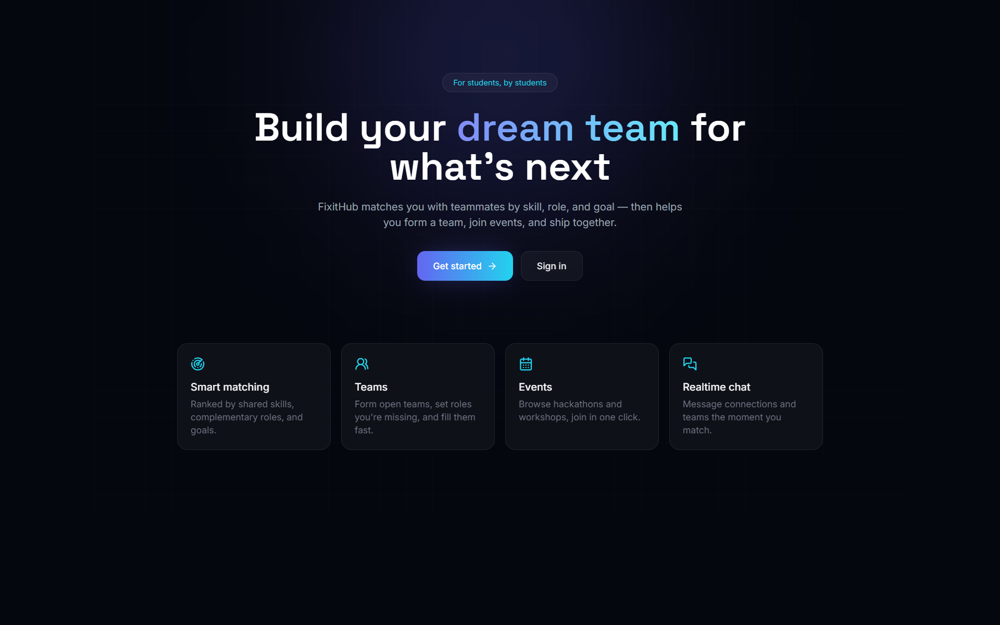
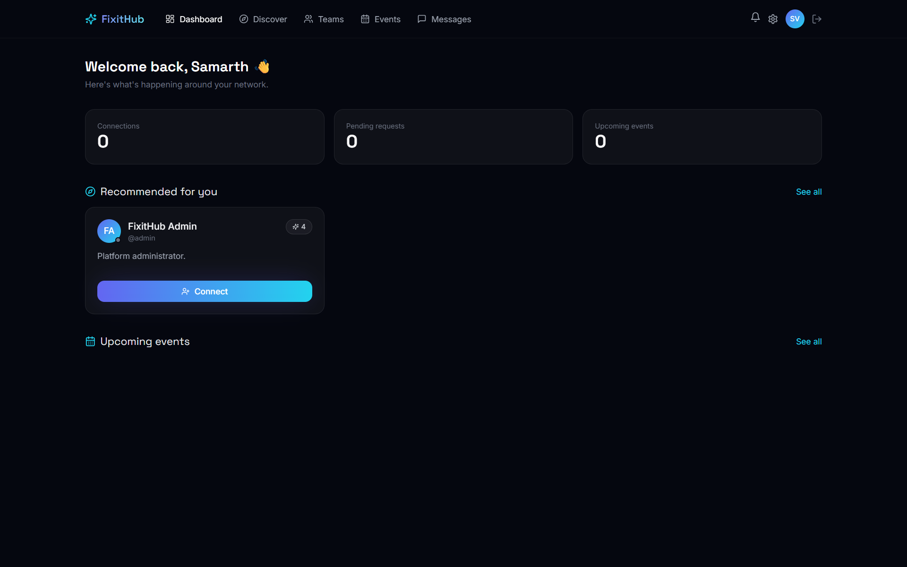
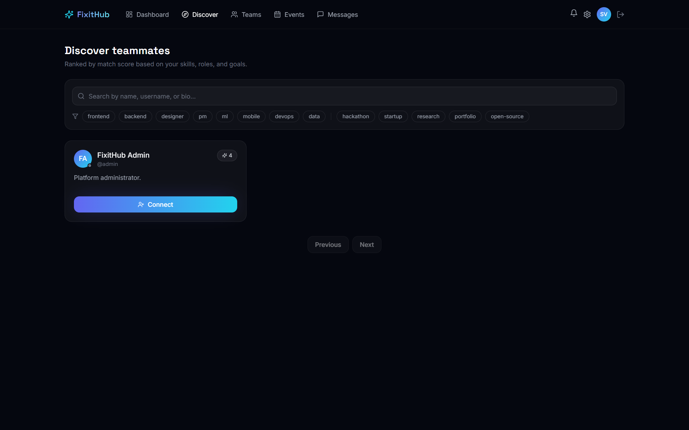
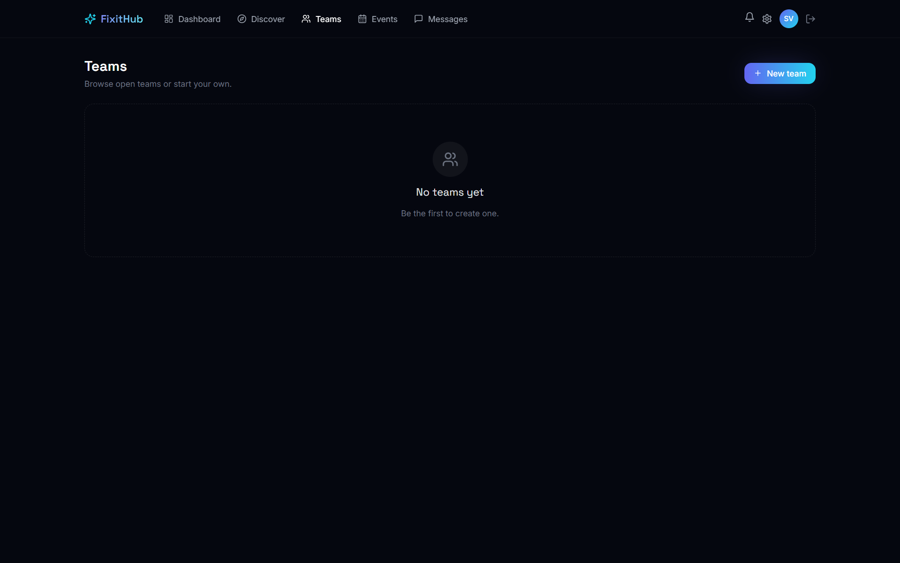
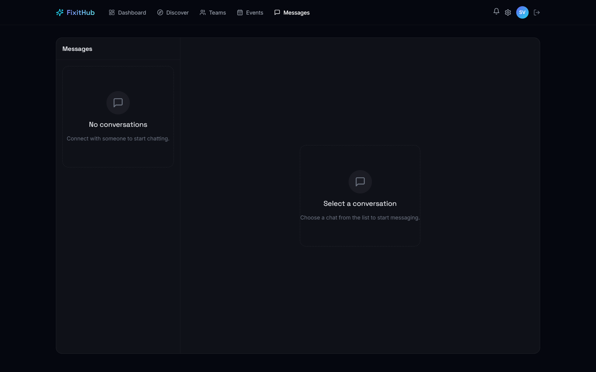

# FixitHub

Full-stack platform to find teammates for hackathons, projects, and events based on skills, roles, goals, and availability.

**Stack:** Next.js 14 · TypeScript · Prisma · PostgreSQL · NextAuth · Socket.io · Zod · Tailwind CSS · Framer Motion · SWR

## Overview







## Features

* Authentication & user profiles
* Skills, roles & availability
* Search, filters & match scoring
* Connection requests
* Teams & team chat
* Events
* Realtime 1:1 & group messaging
* Typing indicators & presence
* Notifications
* Reporting & moderation

## Run

```bash
git clone https://www.github.com/samoff04/FixItHub.git
cd FixItHub
npm install
cp .env.example .env
```

## Project Structure
```
FixItHub/
├── server.ts
├── package.json
├── tsconfig.json
├── next.config.js
├── tailwind.config.ts
├── .env.example
├── .gitignore
├── README.md
├── docs/
├── prisma/
└── src/
    ├── middleware.ts
    ├── lib/
    ├── types/
    ├── hooks/
    ├── components/
    └── app/
        ├── login/
        ├── register/
        ├── dashboard/
        ├── discover/
        ├── profile/
        ├── teams/
        ├── events/
        ├── messages/
        ├── notifications/
        ├── settings/
        ├── admin/
        └── api/
            ├── auth/
            ├── profile/
            ├── discover/
            ├── connections/
            ├── teams/
            ├── events/
            ├── conversations/
            ├── notifications/
            ├── settings/
            └── reports/
```

## Author

Samarth Varshney